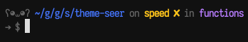

> Seer's theme for [Fisher][fisher-link].

## Install

```fish
$ fisher seeruk/theme-seer
```

## Features

* All the things you need to know about Git at a glance.
* A subtle Gopher hanging out on the left acting as previous command status.
* Consistent width characters for git status.
* Different colours for git branch name depending on state.
* Short path, but separate full relative path from repo root when in a Git repo.

## Screenshot

<p align="center">
  
</p>

# License

[MIT][mit]

# Credits

[bpinto][author] et [al][contributors]


[mit]:          http://opensource.org/licenses/MIT
[author]:       http://github.com/bpinto
[contributors]: https://github.com/oh-my-fish/theme-default/graphs/contributors
[fisher-link]:  https://github.com/jorgebucaran/fisher
